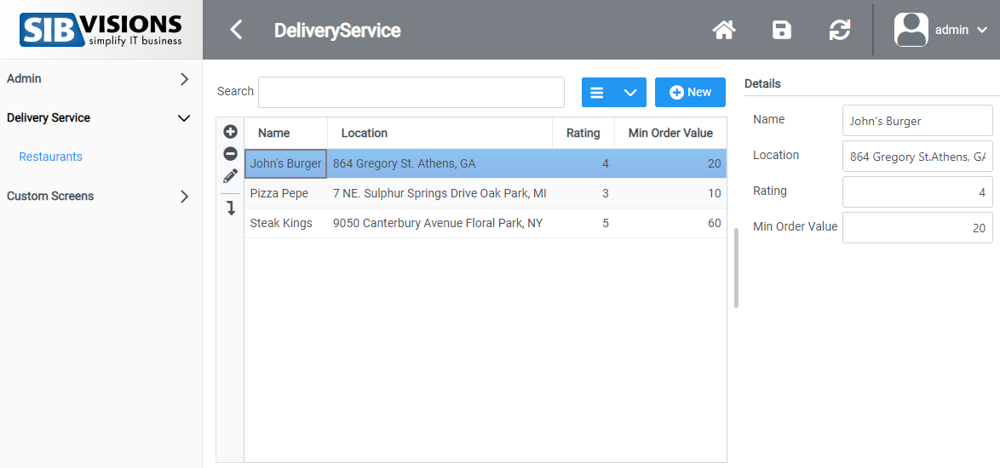
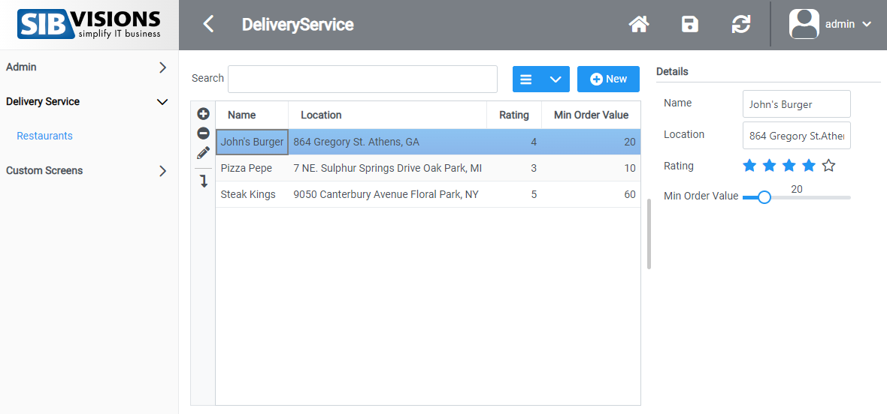
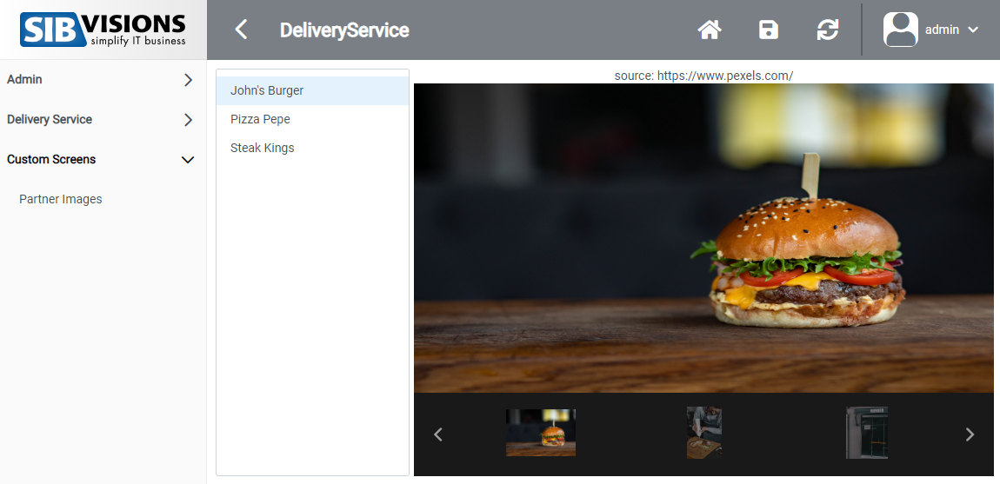

# About

This repository contains a customized reactUI for the [VisionX](https://visionx.sibvisions.com) application Delivery service. 

The application is available in VisionX' marketplace for free. It already contains the customized react UI.

## Initial Configuration
- If you are using create-react-app make sure to downgrade react to v17.0.x (https://stackoverflow.com/a/71908461)
- Run `npm install @sibvisions/reactui` to install the reactUI as dependency
- In your `package.json` file, create a "init" command which copies files from reactui's resource folder to your projects public folder. `Xcopy /E /I .\\node_modules\\@sibvisions\\reactui\\resources .\\public` for windows. `cp -R node_modules/@sibvisions/reactui/resources public` for unix. (This is necessary for themes and color-schemes and other resources)
- Run your init command with `npm run init`

## Live Configuration
When you are running this project live via npm, you'll need to pass some additional URL parameters. Here is an example URL to connect to the "DeliveryService" application: http://localhost:3000/?appName=DeliveryService&baseUrl=http://localhost:80/services/mobile#

## Building & Integrating
- **After** you've run the init command mentioned earlier to copy the resorces, run `npm run build`, to built your react application
- Delete the contents of rad/apps/\<app-name>/WebContent/ui and put your build into this directory
- Create a .custom file to prevent VisionX from overwriting your build

## What is customized?

### Custom Components
The application contains one screen. In this screen, we replaced two number editors (Rating and Minimum Order Value) with our own react components.

For the rating, a rating component was used, which displays the number value as stars. You can set the value by pressing the stars.

For the minimum order value, a slider was used, which can set the minimum order value by sliding the slider.

#### **Before**

#### **After**

The source can be found [here.](https://github.com/sibvisions/visionx.reactUI.deliveryService/blob/main/src/screen-wrappers/ScreenWrapperRestaurants.tsx)

[Click here](https://github.com/sibvisions/reactUI.example/tree/main/src/readme-files/custom-component) for more information about custom-components.

### Custom Screen
Additionally a custom-screen was added which isn't in the default application. 

This custom-screen is a simple react-component which contains a ListBox where you can select different values. Next to it is a gallery which will then display the correct images based on the value.

The source can be found [here.](https://github.com/sibvisions/visionx.reactUI.deliveryService/blob/main/src/CustomRestaurantScreen.tsx)

[Click here](https://github.com/sibvisions/reactUI.example/tree/main/src/readme-files/custom-screen) for more information about custom-screens.

Image source: [https://www.pexels.com](https://www.pexels.com)
